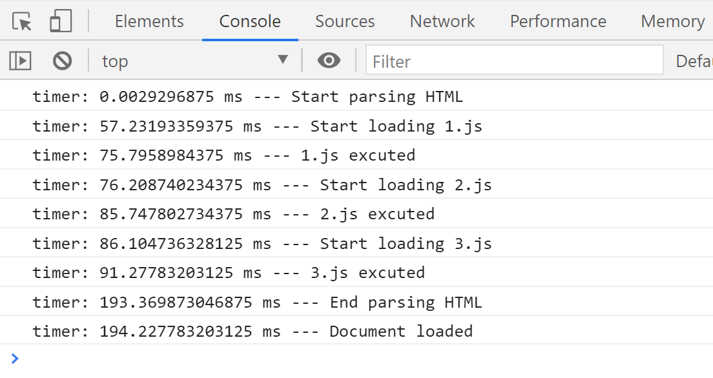
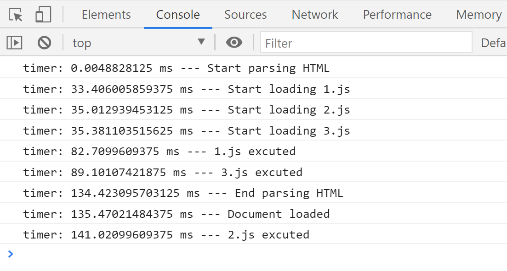
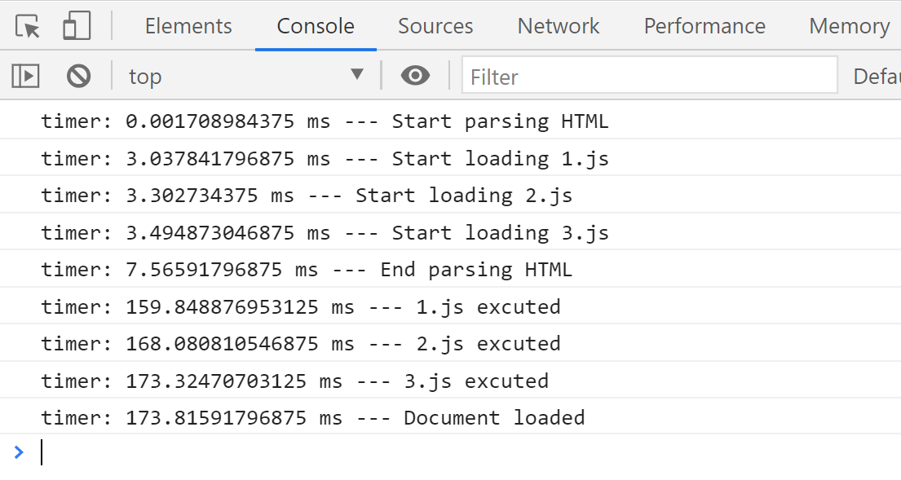

# Async、defer以及普通加载script区别详解

如果用一张图片诠释这几种script加载的特点，应该是这样的：


结合图片我们可以将三种方式的特点总结如下：

1. `<script>` : 当HTML解析过程中遇到script标签时，浏览器中断HTML解析，随即下载script文件，完成后立即执行script，执行完成后再继续HTML解析

2. `<script async>` : 当HTML解析过程中遇到script标签时，**不会**中断HTML解析，同时**并行**下载script文件，下载完成后**中断**HTML解析**并**执行script，执行完成后再继续HTML解析（script的执行顺序不一定按照script标签的出现顺序，而是取决于script下载完成的顺序）

3. `<script defer>` : 当HTML解析过程中遇到script标签时，**不会**中断HTML解析，同时**并行**下载script文件，直到HTML解析完成再执行script（script的执行顺序与script标签出现顺序**一致**）

我们可以通过一个小项目验证上面的结论。

**index.html:**

```html
<!DOCTYPE html>
<html lang="en">

<head>
  <script>
    console.time('timer');
    console.timeLog('timer', '--- Start parsing HTML');
    document.addEventListener('DOMContentLoaded', function () {
      console.timeLog('timer', '--- Document loaded');
    });
  </script>
</head>

<body>
  <p>
    Lorem ipsum dolor sit amet consectetur adipisicing elit. Explicabo harum velit itaque assumenda, quibusdam
    obcaecati suscipit quasi odit accusantium soluta qui, debitis quae iusto? Nobis ratione ut nesciunt a minima.
  </p>
  <!-- 此处省略500行重复元素 -->
  <script>console.timeLog('timer', '--- Start loading 1.js')</script>
  <script src='./1.js'></script>
  <script>console.timeLog('timer', '--- Start loading 2.js')</script>
  <script src='./2.js'></script>
  <script>console.timeLog('timer', '--- Start loading 3.js')</script>
  <script src='./3.js'></script>
  <!-- 此处省略1500行重复元素 -->
   <p>
    Lorem ipsum dolor sit amet consectetur adipisicing elit. Explicabo harum velit itaque assumenda, quibusdam
    obcaecati suscipit quasi odit accusantium soluta qui, debitis quae iusto? Nobis ratione ut nesciunt a minima.
  </p>
  <script>
    console.timeLog('timer', '--- End parsing HTML')
  </script>
</body>

</html>
```

**1.js:**

```js
const text1 = `
  // 超长文本
`

text1.split(' ');
console.timeLog('timer', '--- 1.js excuted');
```

**2.js:**

```js
const text2 = `
  // 超长文本
`

text2.split(' ');
console.timeLog('timer', '--- 2.js excuted');
```

**1.js:**

```js
const text3 = `
  // 超长文本
`

text3.split(' ');
console.timeLog('timer', '--- 3.js excuted');
```

我们分别使用普通、async和defer的方式加载1.js、2.js、3.js，观察控制台的打印结果：

**普通:**



> 结论：script出现会**中断**HTML加载，且script会顺序的加载、执行，所有script执行完成后再解析HTML。

**Async:**



> 结论：HTML解析和script下载**同步**进行，script执行会中断HTML解析；script执行顺序和tag出现顺序不一定相同；script可能会在**document loaded之后**执行。

**Defer:**



> 结论：HTML解析和script下载**同步**进行；script会在**HTML解析完成后**和**document loaded之前**执行，且执行顺序和tag出现顺序一致。

由以上实验可知：如果使用普通方式时通常建议将script放到`<body>`的最后，以免阻塞HTML解析影响网页打开速度。而**defer**相对于**async**更具优势，不会阻塞HTML解析且script的执行顺序可以预测，有一些需要预先下载执行的script可以使用**defer**的方式在`<head>`中引用。

本文code地址：https://github.com/MudOnTire/script-normal-async-defer-loading